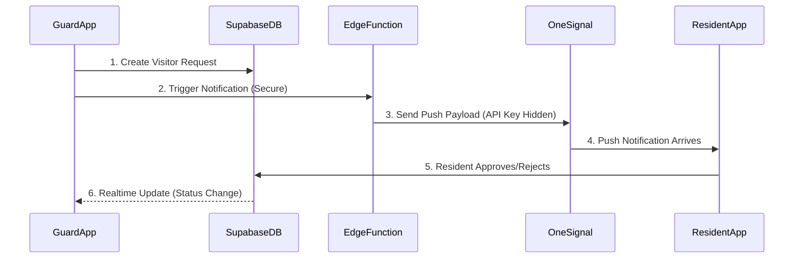
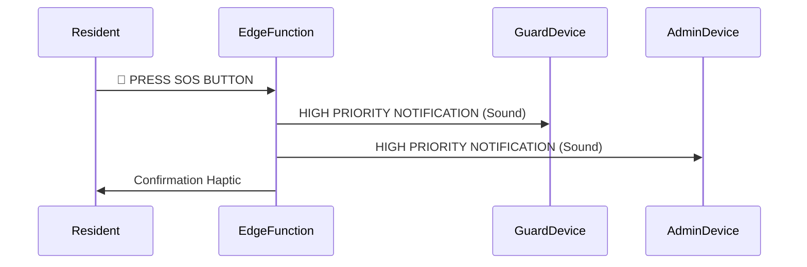

# 🌙 ApnaGate - Smart Society Management System

[](https://flutter.dev) [](https://supabase.com) [](https://onesignal.com)

Welcome to **ApnaGate**, a premium, secure, and modern society management application built with Flutter and Supabase. This project streamlines communication between Residents, Guards, and Adminstrators.

---

## 🚀 Key Features

### 👤 For Residents
- **📱 Visitor Approvals**: Get instantly notified when a guest arrives (with photo). Approve or Deny in one tap.
- **🎟️ Guest Pass**: Share a digital pass with guests for hassle-free entry.
- **🚨 SOS Alert**: Trigger an emergency alarm that notifies all guards and admins instantly.
- **🛠️ Service Directory**: Find local plumbers, electricians, and more.
- **📢 Notice Board**: Stay updated with society announcements.

### 🛡️ For Guards
- **📸 Scan & Verify**: Scan Guest Passes or take visitor photos for verification.
- **📞 Intercom**: Call residents directly from the app (via VOIP/Phone).
- **📝 Digital Log**: No more paper registers. All entries are synced to the cloud.

### 👑 For Admins
- **📊 Dashboard**: View realtime stats (Visitors, Complaints, Alerts).
- **🏢 Structure Management**: Configure Wings, Floors, and Flats dynamically.
- **📢 Broadcast**: Send notices and alerts to all residents.

---

## 🏗️ Architecture & Flow

The app is built on a **Security-First Architecture** using Supabase Edge Functions.

### Notification Flow (Secure)


### SOS Alert Flow


---

## 🛠️ Technology Stack

- **Frontend**: Flutter (Riverpod for State Management)
- **Backend**: Supabase (PostgreSQL, Auth, Realtime, Storage, Edge Functions)
- **Notifications**: OneSignal (Routed via Edge Functions)
- **Deployment**: Android (APK/AAB) & iOS (IPA)

---

## ⚙️ Setup Guide (For Developers)

### 1️⃣ Prerequisites
- Flutter SDK (`> 3.10.x`)
- Supabase CLI
- OneSignal Account

### 2️⃣ Backend Setup (Supabase)
1. **Create Project**: Start a new project on [Supabase.com](https://supabase.com).
2. **Apply Schema**: Run the SQL script found in `COMPLETE_SCHEMA.sql` in the Supabase SQL Editor.
   - This sets up all tables (Profiles, Visitors, etc.) and Row Level Security (RLS) policies.
3. **Deploy Edge Function**:
   ```bash
   supabase login
   supabase link --project-ref your-project-id
   supabase functions deploy send-notification
   ```
4. **Set Secrets**:
   ```bash
   supabase secrets set ONESIGNAL_REST_API_KEY=your_key
   supabase secrets set ONESIGNAL_APP_ID=your_app_id
   ```

### 3️⃣ Frontend Setup (Flutter)
1. **Clone Repo**:
   ```bash
   git clone https://github.com/Coderaryanyadav/ApnaGate.git
   cd app
   ```
2. **Config**:
   - Rename `lib/supabase_config_example.dart` to `lib/supabase_config.dart`.
   - Add your `supabaseUrl` and `supabaseAnonKey`.
3. **Run**:
   ```bash
   flutter pub get
   flutter run
   ```

---

## 📂 Project Structure

```bash
lib/
├── main.dart                  # 🏁 Entry Point
├── models/                    # 📦 Data Models (User, Visitor, etc.)
├── screens/
│   ├── admin/                 # 👑 Admin Screens
│   ├── guard/                 # 🛡️ Guard Screens
│   └── resident/              # 🏠 Resident Screens
├── services/
│   ├── auth_service.dart      # 🔐 Login/Logout Logic
│   ├── firestore_service.dart # ☁️ Database Interactions (Supabase)
│   ├── notification_service.dart # 🔔 Notification Handling
│   └── storage_service.dart   # 📸 Image Uploads
└── widgets/                   # 🧩 Reusable UI Components
```

---

## 🛡️ Security Note for Beginners

**Rule #1: Never expose API Keys in the App.**
We removed the OneSignal REST API Key from the Flutter code. Instead, the app calls `supabase.functions.invoke('send-notification')`. The Edge Function (running on the server) holds the key and talks to OneSignal. This prevents hackers from stealing your key and sending fake alerts.

**Rule #2: RLS Policies.**
The database is protected by "Row Level Security".
- A resident can only see *their own* visitors.
- A guard can see *all* visitors.
This is defined in the `COMPLETE_SCHEMA.sql` file.

---

## 🤝 Contributing
1. Fork the Project
2. Create your Feature Branch (`git checkout -b feature/AmazingFeature`)
3. Commit your Changes (`git commit -m 'Add some AmazingFeature'`)
4. Push to the Branch (`git push origin feature/AmazingFeature`)
5. Open a Pull Request
